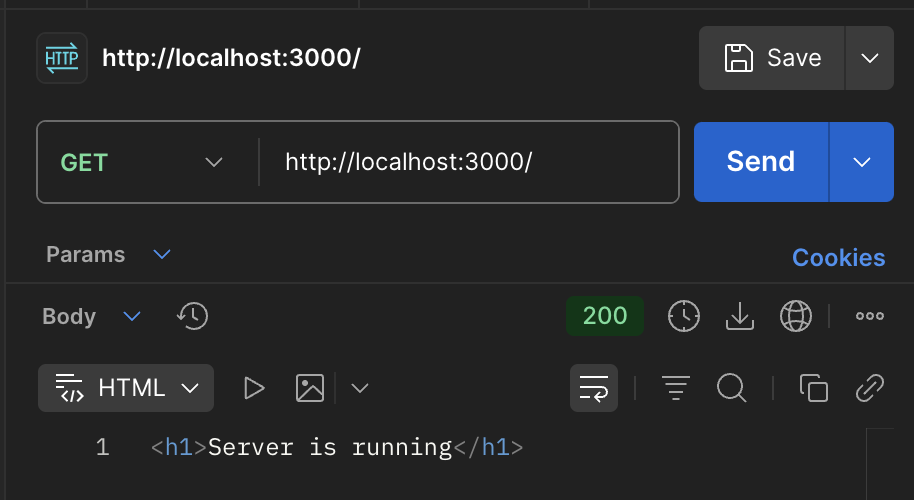
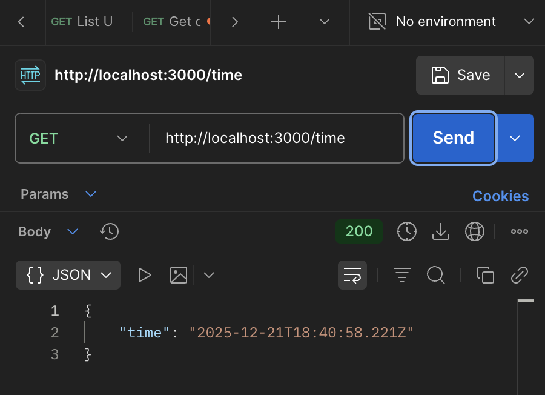
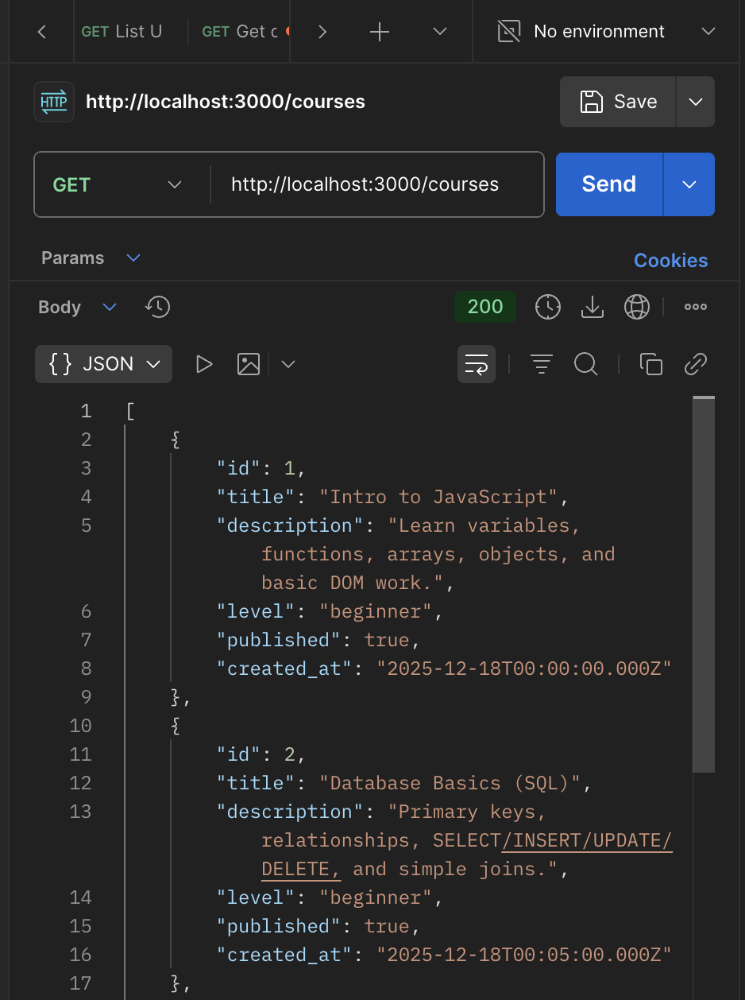
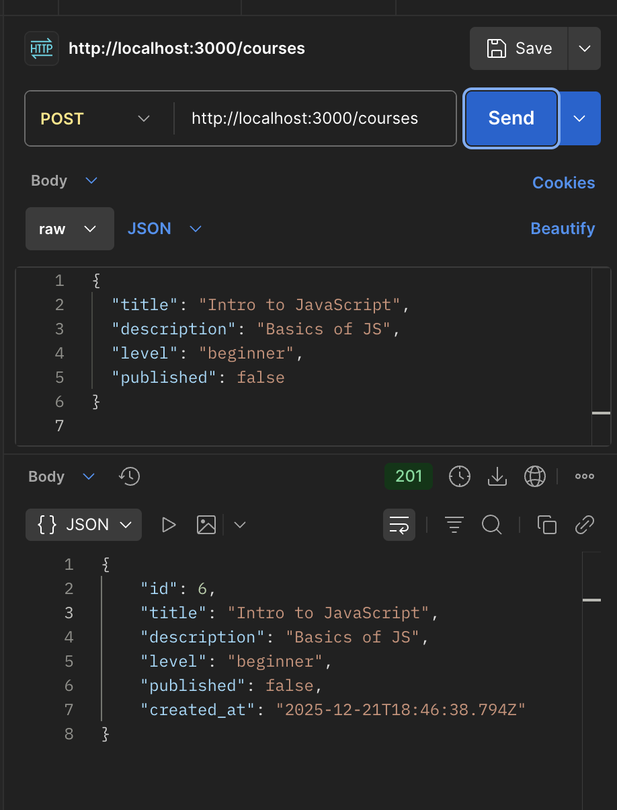
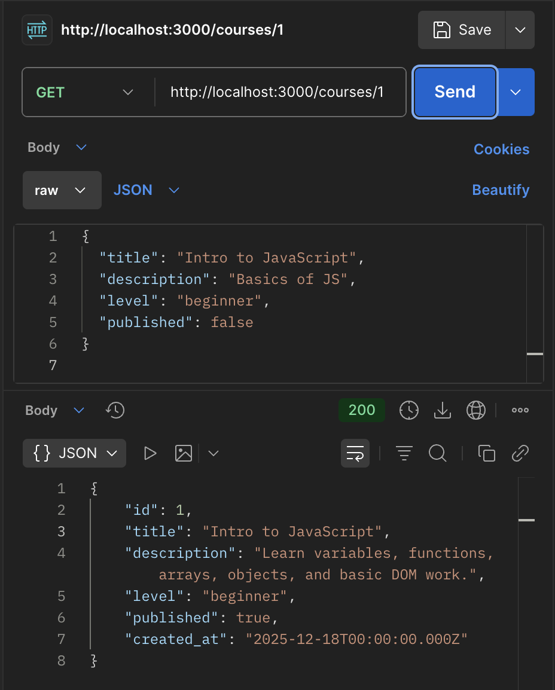
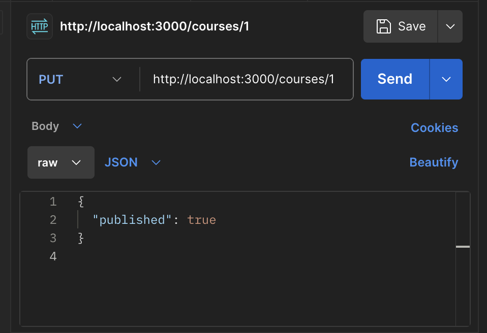

# LMS Backend API (Express)

Backend API for a simple Learning Management System (LMS), built with **Node.js** and **Express**.  
At the current stage, data is stored in a local JSON file (`data.json`).  
The project is designed so it can be easily extended later (database, authentication, frontend).

## Project Goals
- Learn how to build a REST API with Express
- Implement basic CRUD operations
- Work with file-based JSON storage
- Document API using Swagger
- Prepare backend that can be reused for a future frontend

---

## Features
- Express server setup
- Demo routes for testing server status
- Courses CRUD (Create, Read, Update, Delete)
- Persistent storage using `data.json`
- Swagger UI documentation available at `/docs`

---

## Tech Stack
- **Node.js**
- **Express**
- **swagger-ui-express**
- **swagger-jsdoc**
- File storage: JSON

---

## Project Structure
```

express-backend/
server.js
data.json
package.json
README.md
routes/
demo.routes.js
courses.routes.js
utils/
storage.js
docs/
swagger.js

````

---

## Installation
Install dependencies:
```bash
npm install
````

---

## Run the Server

```bash
node server.js
```

Server will start at:

```
http://localhost:3000
```

Swagger documentation:

```
http://localhost:3000/docs
```

---

## API Routes
## Postman Screenshots

### Server is running


### Time



### Get all courses


### Post courses


### Get courses by ID



### Edit courses by ID


## Notes

* This project does not use a database yet
* Authentication is not implemented
* Designed to be extended with:

  * users / students
  * lessons
  * database (MongoDB / PostgreSQL)
  * frontend (React / Next.js)

---

